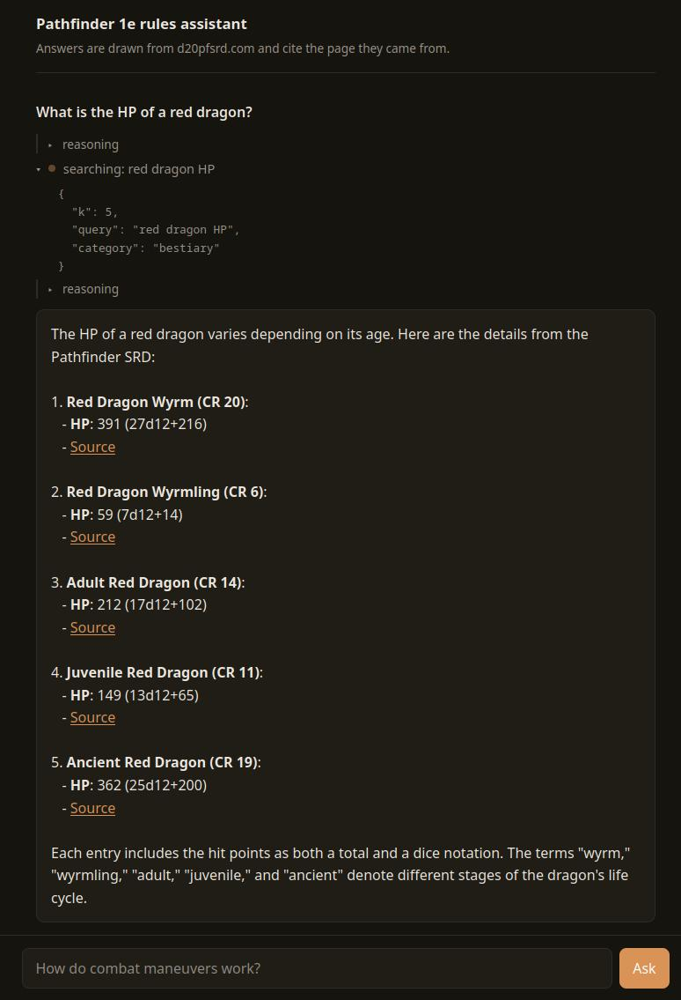

[](https://github.com/fdoiron/pathfinder-rag/actions/workflows/ci.yml)

A retrieval augmented question/answering pipeline over the Pathfinder 1e tabletop ruleset. It scrapes ~24k rule pages from [d20pfsrd.com](https://www.d20pfsrd.com/), parses them into markdown with a hand written converter, chunks and embeds them locally, and answers rules questions with citations back to the page they originated from. Retrieval is hybrid (vector plus BM25 fused with Reciprocal Rank Fusion, then reranked) and is exposed two ways: a single shot `rag ask` CLI, and an MCP server offering it as tools that a separate agent client calls in a multi hop loop until it can answer. A chat page served by the agent puts that loop in front of a browser, streaming what the agent is doing while it works. This is a portfolio project covering the whole path from data ingestion through evaluated retrieval to an evaluated agent loop and the surface that drives it, with the container phase designed and staged as what's next.

## Contents

- [Demo](#demo) — `rag search`, `rag ask` and `pathfinder-agent ask` against the real corpus
- [What works right now](#what-works-right-now)
- [Quickstart](#quickstart)
- [Repo layout](#repo-layout)
- [Architecture](#architecture)
- [Evaluation](#evaluation) — [Hybrid retrieval](#hybrid-retrieval) · [Reranker](#reranker) · [Answer-level](#answer-level-evaluation) · [Agent loop](#agent-loop-evaluation)
- [Roadmap](#roadmap) — [MVP Expansions](#mvp-expansions) · [Future expansions](#future-expansions)
- [Design decisions](#design-decisions)
- [Testing](#testing)
- **[Post mortem](#post-mortem)** — bugs, dead ends and measurement mistakes, written up in [POSTMORTEM.md](POSTMORTEM.md)
- [License and attribution](#license-and-attribution)

## Demo

The chat page mid answer: a box per tool call, expanded to the arguments that call went out with, the model's reasoning between hops, and every number cited back to the page it came from.



Underneath it is the same retrieval the `rag` CLI exposes directly:

```
$ uv run rag search "power attack"
--- Result 1 ---
Score: 0.996
Title: Power Attack (Combat)
URL: https://www.d20pfsrd.com/feats/combat-feats/power-attack-combat
--- Result 2 ---
Score: 0.965
Title: Simple Monster Creation
URL: https://www.d20pfsrd.com/gamemastering/other-rules/unchained-rules/simple-monster-creation
--- Result 3 ---
Score: 0.961
Title: Stunning Assault (Combat)
URL: https://www.d20pfsrd.com/feats/combat-feats/stunning-assault-combat
--- Result 4 ---
Score: 0.934
Title: Pushing Assault (Combat)
URL: https://www.d20pfsrd.com/feats/combat-feats/pushing-assault-combat
--- Result 5 ---
Score: 0.926
Title: Feat Tree
URL: https://www.d20pfsrd.com/feats/feat-tree
```

`search` defaults to `--rerank`, so the printed score is the reranker's yes-probability that the chunk answers the query (log-softmax over the "yes"/"no" next-token logits, `[0, 1]`, higher is more relevant). It is not a fused retrieval score. The reranker's job is clearly visible: Power Attack pulls ahead of everything else in the pool (0.996 vs 0.965 and below), including pages like "Simple Monster Creation" and "Feat Tree" that only rank at all because they happen to mention Power Attack in passing. With `--no-rerank`, `search` prints the underlying `--method hybrid` Reciprocal Rank Fusion score instead:

```
$ uv run rag search "power attack" --no-rerank
--- Result 1 ---
Score: 0.262
Title: Power Attack (Combat)
URL: https://www.d20pfsrd.com/feats/combat-feats/power-attack-combat
--- Result 2 ---
Score: 0.257
Title: Furious Focus (Combat)
URL: https://www.d20pfsrd.com/feats/combat-feats/furious-focus-combat
--- Result 3 ---
Score: 0.254
Title: Two-Handed Fighter
URL: https://www.d20pfsrd.com/classes/core-classes/fighter/archetypes/paizo-fighter-archetypes/two-handed-fighter
--- Result 4 ---
Score: 0.250
Title: Mythic Tiberolith
URL: https://www.d20pfsrd.com/bestiary/monster-listings/constructs/mythic-tiberolith
--- Result 5 ---
Score: 0.244
Title: Powerful Poisoning
URL: https://www.d20pfsrd.com/feats/general-feats/powerful-poisoning
```

This is a Reciprocal Rank Fusion score (bounded by `(rrf_vector_weight+rrf_bm25_weight)/(rrf_k+1) ≈ 0.262` at the current defaults, `rrf_k=60`, `rrf_vector_weight=15`, `rrf_bm25_weight=1`) not a similarity score. RRF ranks and doesn't measure; only the order matters and close scores like results 2 to 4 are how RRF behaves. Use `--method vector` for cosine similarities instead. `--method bm25` prints SQLite FTS5's raw `bm25()` score instead: negative and unbounded, more negative ranks better.

```
$ uv run rag ask "can I move and attack in the same round?"
Yes, you can move and attack in the same round under certain conditions. For example, during a
**charge**, you move before attacking, and may move up to double your speed [1]. The **Spring
Attack** feat allows you to move up to your speed, make a melee attack, and then move again as
part of a full-round action [3]. Additionally, if you have a base attack bonus of +1 or higher,
you can combine a standard action (such as an attack) with movement [4].

[1] Combat — Combat > Special Attacks > Charge > Movement During a Charge
    https://www.d20pfsrd.com/gamemastering/combat
[3] Spring Attack (Combat) — Spring Attack (Combat)
    https://www.d20pfsrd.com/feats/combat-feats/spring-attack-combat
[4] Combat — Combat > Actions In Combat > Action Types > Standard Action
    https://www.d20pfsrd.com/gamemastering/combat
```

`[4]` cites the `Standard Action` section: the baseline rule that a move action plus a standard action needs no feat at all, found from the `fetch_k=50` reranked pool. Retrieval doesn't always find the correct chunk; see [Answer-level evaluation](#answer-level-evaluation) for the aggregate pattern of confident answers with incomplete retrieval.

The same question through the agent instead, which calls the MCP server's tools itself rather than being handed one set of excerpts:

```
$ uv run pathfinder-agent ask "can I move and attack in the same round?"
In Pathfinder 1e, you can move and attack in the same round under normal circumstances by using
your **move action** and **standard action**. Here's how:

1. **Standard Movement and Attack**:
   - You can move up to your full speed (using a **move action**) and still perform a **standard
     action** (such as attacking) in the same round.
   - If you move **double your speed** (by using both your move actions), you cannot take any
     other actions besides moving.

   *Source*: [Combat > Movement, Position, and Distance > Tactical Movement](https://www.d20pfsrd.com/gamemastering/combat#TOC-Tactical-Movement)
   > *"Generally, you can move your speed in a round and still do something (take a move action
   > and a standard action)."*

2. **Charging**:
   - When charging, you **must move before attacking**, moving at least 10 feet (2 squares)
     toward the target. You can move up to **double your speed**.

   *Source*: [Combat > Special Attacks > Charge > Movement During a Charge](https://www.d20pfsrd.com/gamemastering/combat#TOC-Movement-During-a-Charge)

[... a third section on the Mobile Melee variant rule, and a Key Takeaways summary, trimmed here ...]

rag_search {'query': 'move and attack same round', 'category': 'gamemastering', 'k': 3}
rag_search {'category': 'gamemastering', 'k': 5, 'query': 'move and attack same round'}
```

The two `rag_search` lines at the bottom are the agent's tool-call trace, printed after the answer. Two known failures are visible in that one run and both are scoped as `E8`. The two searches are the same search twice: the first was rejected because `k=3` is below the schema's `ge=5` bound, so a whole hop went on discovering the bound. And every `#TOC-` anchor in those citations is fabricated. Across the 381 runs in [Agent loop evaluation](#agent-loop-evaluation) the tools returned 407 distinct URLs and not one carried a fragment as they are not present in the chunked corpus: the pages are real and the section #TOC- are the model's own invention. It also answers at far greater length than the question strictly requires which nothing in the system prompt currently discourages.

All four runs above against the real corpus with the current hybrid index, `qwen3:14b` served by a local `ollama serve`. `ask` output is not deterministic, the wording and the subset of excerpts cited will vary between runs.

## What works right now

Scraping, parsing, chunking, embedding, hybrid search (BM25 + vector, fused with Reciprocal Rank Fusion), reranking and generation all run end to end over the full corpus. `rag build-corpus` does parse, chunk, embed and build the BM25 index in one pass, writing two parquet artifacts, a SQLite FTS5 index, and a manifest; `rag search`, `rag ask`, `rag evaluate` and `rag evaluate-answers` all take `--method {vector,bm25,hybrid}` and `--rerank/--no-rerank` (on by default, a local Qwen3-Reranker re-scores a candidate pool before cutting to `k`; `search`/`ask` also expose `--fetch-k` to size that pool) and load straight from disk to answer or score from the terminal. `rag evaluate-answers` runs the same truth set through `rag ask` itself, scoring whether the generated answer cites the correct source, invents a citation number outside what it was given, or refuses when it doesn't know.

The same retrieval is served over MCP. `rag-mcp` runs a streamable-http server exposing `rag_search` and `fetch_section` as tools with optional static bearer auth, OpenTelemetry traces and metrics and a single GPU worker fronted by a bounded queue that sheds excess load. `pathfinder-agent` is a separate uv project that connects to it and runs a multi hop tool calling loop with per hop and wall time timeouts, a tool result token budget, bounded retries with backoff, and `<tool_result>` delimiting on everything the server returns. `pathfinder-agent ask "question"` is the agent equivalent of `rag ask`, and `agent/scripts/loop_eval.py` measures how that loop behaves across the eval set (see [Agent loop evaluation](#agent-loop-evaluation)). `POST /ask` runs that same loop over SSE and serves a single static so a question typed in a browser shows a progress box per tool call, the arguments each call went out with and the model's reasoning between hops, then the answer in one shot. The frontend is deliberately thin and is not the artifact. The engineering is the loop behind it. The containers are in [Future expansions](#future-expansions).

24,098 HTML files in, 23,890 cleaned articles out, chunked into 129,361 chunks and embedded at 1024 dims. Parsing and chunking run in under a minute single threaded; embedding the full corpus locally takes roughly 15 minutes on an RTX3090. HTML scraping with Scrapy (/scraper) takes roughly 6 hours with a 1s crawl delay per page.

Dropped pages (208 total):
- 207 pages too small after stripping to be worth indexing
- 1 page where the original URL was too long and was hashed so the source URL couldn't be reconstructed

```
$ cd rag-mcp
$ uv run rag build-corpus ../scraper/data/html
INFO:root:Parsing HTML files from ../scraper/data/html
WARNING:rag.parsing:dropped 'bestiary__monster-listings__aberrations__dark-young': body too short (19 < 100 chars)
INFO:root:Loading tokenizer Qwen/Qwen3-Embedding-0.6B
INFO:root:Chunking articles
wrote 23890 articles to data/corpus.parquet
INFO:root:Loading embedder Qwen/Qwen3-Embedding-0.6B
INFO:root:Embedding 129361 chunks
wrote 129361 chunks to data/chunks.parquet
wrote fts5 index to data/chunks.fts5.db
wrote manifest to data/chunks.manifest.json
```

## Quickstart

The scraped HTML corpus is not included in the repo (24k files). You need to run the scraper first, or point `build-corpus` at your own directory of d20pfsrd.com HTML pages. `rag ask` and the agent both need a local Ollama server with a model pulled, and the agent additionally needs the MCP server running. Whichever command uses the embedder first (`build-corpus` or `search`) downloads ~1.2 GB of Qwen3-Embedding-0.6B weights from Hugging Face Hub as a one time cost. `search`, `ask`, `evaluate` and `evaluate-answers` also default to `--rerank`, which downloads another ~1.2 GB (Qwen3-Reranker-0.6B) the first time; pass `--no-rerank` to skip it. Cached afterwards.

```bash
git clone https://github.com/fdoiron/pathfinder-rag.git
cd pathfinder-rag

# 1. scrape (slow, respects a 1s crawl delay, ~24k pages)
cd scraper
uv sync
cp .env.example .env # fill in a contact email for the User-Agent
uv run python discover_urls.py # discovers and filters the URL list to scrape, writes d20pfsrd_links.parquet
uv run scrapy crawl d20pfsrd

# 2. parse, chunk and embed into a searchable corpus
cd ../rag-mcp
uv sync
uv run rag build-corpus ../scraper/data/html

# 3. search (no LLM needed; downloads embedding + reranker weights on first run, add --no-rerank to skip the latter)
uv run rag search "power attack"

# 4. ask, needs a local Ollama server
ollama pull qwen3:14b
ollama serve
uv run rag ask "can I move and attack in the same round?"

# 5. evaluate retrieval against the hand verified truth set
uv run rag evaluate eval/queries.jsonl

# 6. evaluate whether rag ask's answers actually cite the correct source
# (rerank is on by default here; the README's answer-level table predates the reranker, pass --no-rerank to match it)
uv run rag evaluate-answers eval/queries.jsonl

# 7. run the MCP server, serving rag_search and fetch_section over streamable-http on :8000
# (loads the embedder, the reranker and the FTS index before it binds, close to a minute)
uv run python src/rag/mcp_server.py

# 8. in a second terminal, ask the agent instead of the single shot CLI
# it queries the server from step 7 and calls tools until it can answer
cd ../agent
uv sync
uv run pathfinder-agent ask "can I move and attack in the same round?"

# 9. or serve the same loop as a chat page, from agent/ so it finds its .env
# --host 0.0.0.0 makes it reachable from other machines on the LAN, drop it to stay on loopback
uv run uvicorn pathfinder_agent.server:app --host 0.0.0.0 --port 8099
# then open http://localhost:8099

# 10. measure how the loop behaves over the truth set (needs the server and Ollama up)
uv run python scripts/loop_eval.py --questions-file ../rag-mcp/eval/queries.jsonl --repeats 3

# 11. run the test suite in any package (doesn't require the scraped corpus)
uv run pytest
```

Both processes read `.env` from the process working directory, so start the server from `rag-mcp/` and the agent or the chat app from `agent/`. Setting `RAG_MCP_AUTH_TOKEN` in `rag-mcp/.env` turns on static bearer auth and the agent picks the same variable up from `agent/.env` for the `Authorization` header, which is why starting either one from the repo root silently gets it wrong: the server finds no token and disables auth, or the app dials with no header. Leaving it unset disables auth entirely, which is fine on loopback and logged as a warning at startup.

## Repo layout

- `scraper/` : Scrapy spider + URL discovery, scrapes d20pfsrd.com into `scraper/data/html/`
- `rag-mcp/` : parsing, chunking, embedding, retrieval, eval, the `rag` CLI and the MCP server; everything downstream of the scraped HTML
- `agent/` : `pathfinder-agent`, the MCP client running the tool calling loop, plus the loop eval instrument

## Architecture

**Current state**, the corpus build is a batch step and everything downstream is either a CLI call or a local service:

```
scraper (Scrapy)  ──▶  scraper/data/html/ (24,098 files)
                              │
                              ▼
          rag build-corpus  (parse → chunk → embed → index)
                              │
                              ▼
    data/: corpus.parquet (23,890 articles), chunks.parquet (129,361 chunks + embeddings),
           chunks.fts5.db (SQLite FTS5 lexical index), manifest
                              │
                ┌─────────────┴─────────────┐
                ▼                           ▼
   rag search / rag ask              rag-mcp server (streamable-http, :8000)
   in process retrieval,             rag_search + fetch_section as MCP tools,
   one search per question           bearer auth, OTel, 1 GPU worker + bounded queue
                │                            │
                │                            ▼
                │                 pathfinder-agent ask
                │                 multi hop loop, calls tools until it can answer
                │                            │
                └────────────┬───────────────┘
                             ▼
                  cited answer + d20pfsrd URLs

  both paths generate with Ollama (localhost, OpenAI compatible)
```

**Target service architecture**, see [MVP Expansions](#mvp-expansions):

```
┌──────────────┐  HTTP + SSE  ┌────────────────────┐   MCP over        ┌────────────────────┐
│  chat page   │ ──────────▶ │  pathfinder-agent  │ streamable-http   │   rag-mcp server   │
│  (static,    │ ◀────────── │  POST /ask + the   │ ───────────────▶ │  rag_search        │
│  served by   │   progress   │  agent loop        │                   │  fetch_section     │
│  the agent)  │   events     └────────────────────┘                   └────────────────────┘
└──────────────┘                        │                                        │ reads
                                        │ OpenAI compatible                      ▼
                                        ▼                               ┌──────────────────┐
                                 ┌─────────────┐                        │   data volume    │
                                 │   Ollama    │                        │  parquet + fts5  │
                                 └─────────────┘                        │  + manifest      │
                                                                        └──────────────────┘
┌─────────────┐   writes
│  scraper    │ ──────────▶ the same data volume, as a batch Job rather than a service
│ (batch Job) │
└─────────────┘
```

Two deployables, `rag-mcp` and `agent`; the third uv project, `scraper`, is a batch step rather than a service. Everything above exists and runs; what remains is packaging it, which is [Future expansions](#future-expansions).

## Evaluation

127 hand verified queries in `rag-mcp/eval/queries.jsonl`, split into three types (`exact_name`, `paraphrase`, `rules_reasoning`), scored at the URL level (a document counts as found if any of its chunks lands in the retrieved set). The first two subsections are organized by major improvement over basic vector retrieval, each isolating one change (retrieval method, reranking, and future ones like chunk sizing or long article handling) with its own before/after. The last two measure a different axis on the same truth set: [Answer-level evaluation](#answer-level-evaluation) scores what the generator does with whatever retrieval hands it, and [Agent loop evaluation](#agent-loop-evaluation) scores the agent path rather than a retrieval change, so it has no before/after and reports whether the model used its tools at all. Current best retrieval: hybrid plus reranking, `k=50`:

| Type | n | Recall@1 | Recall@3 | Recall@5 | Recall@50 | MRR |
|---|---|---|---|---|---|---|
| **Overall** | 127 | 0.67 | 0.85 | 0.88 | 0.98 | 0.77 |
| `exact_name` | 55 | 0.69 | 0.91 | 0.93 | 1.00 | 0.80 |
| `paraphrase` | 38 | 0.55 | 0.76 | 0.82 | 0.95 | 0.67 |
| `rules_reasoning` | 34 | 0.76 | 0.85 | 0.88 | 1.00 | 0.83 |

### Hybrid retrieval

Vector-only, BM25-only and hybrid (RRF, `rrf_k=60`) were each run with a retrieval depth of 5 against the same truth set and the same corpus. Hybrid appears twice: at equal (1:1) fusion weight, and at the current default of vector weighted 15x over BM25. Bold marks the default configuration, not the best cell:

| Type | Method | Recall@1 | Recall@3 | Recall@5 | MRR |
|---|---|---|---|---|---|
| **Overall** (n=127) | Vector | 0.45 | 0.73 | 0.80 | 0.60 |
| | BM25 | 0.22 | 0.31 | 0.35 | 0.27 |
| | Hybrid (1:1) | 0.46 | 0.70 | 0.76 | 0.58 |
| | **Hybrid (15:1)** | 0.46 | 0.75 | 0.80 | 0.61 |
| `exact_name` (n=55) | Vector | 0.51 | 0.78 | 0.87 | 0.66 |
| | BM25 | 0.49 | 0.67 | 0.76 | 0.59 |
| | Hybrid (1:1) | 0.56 | 0.71 | 0.78 | 0.65 |
| | **Hybrid (15:1)** | 0.55 | 0.82 | 0.89 | 0.69 |
| `paraphrase` (n=38) | Vector | 0.32 | 0.53 | 0.55 | 0.42 |
| | BM25 | 0.00 | 0.00 | 0.00 | 0.00 |
| | Hybrid (1:1) | 0.32 | 0.53 | 0.55 | 0.42 |
| | **Hybrid (15:1)** | 0.32 | 0.53 | 0.55 | 0.42 |
| `rules_reasoning` (n=34) | Vector | 0.50 | 0.88 | 0.94 | 0.69 |
| | BM25 | 0.03 | 0.06 | 0.06 | 0.04 |
| | Hybrid (1:1) | 0.44 | 0.88 | 0.94 | 0.67 |
| | **Hybrid (15:1)** | 0.50 | 0.88 | 0.94 | 0.69 |


BM25 ties vector on `exact_name` recall@1 (0.49 vs 0.51) but returns nothing on `paraphrase` (MRR 0.00, a paraphrase by construction shares few literal words with its target page) and is not useful on `rules_reasoning` (recall@1 0.03). Fusing it in at equal (1:1) RRF weight was a net negative at n=127, which is what the `Hybrid (1:1)` rows above show against vector-only: overall recall@3 0.73 → 0.70, recall@5 0.80 → 0.76 and MRR 0.60 → 0.58 all moved against hybrid, for only a noise level recall@1 tick (0.45 → 0.46). `rules_reasoning` recall@1 drops outright, 0.50 → 0.44. A close sibling or variant of the correct page (a poison stat block sharing a condition's name, a `Greater X` version of the base feat, a parent class page over its own subpage) routinely outscored the canonical page on literal term overlap and RRF has no sense of how close it is numerically, it only uses ranks, so it cannot tell that apart from a genuinely wrong page. Weighting vector 15x over BM25 in the fused score (swept in `scripts/rrf_weight_sweep.py`, [sweep output](rag-mcp/eval/canonical/n127_rrf_weight_sweep.json)) fixes this issue. That value was picked by maximizing MRR over this same n=127 set, with no held out split at this size to sharpen it further. It sits on a plateau rather than a knife's edge: weights 10, 15, 20, 30 all score MRR 0.603-0.609, a spread smaller than one query flipping. The defensible claim is heavily down-weight BM25 not that 15 specifically is optimal.

Down-weighting BM25 contains its failure mode rather than eliminating it entirely. 18 queries still change rank between vector-only and weighted hybrid (10 up, 8 down), about half the churn of the unweighted version (32, split 15/17), and the same sibling page confusion from above is still visible in the 8 moving down. `outsider creature type` (2 → 3) still loses to general reference pages (`Simple Monster Creation`, `Creature Types & Subtypes`) ahead of the specific `Outsiders` category page, and `sorcerer bloodline` (2 → 3) still loses to the parent `Sorcerer` class page over its own `Bloodlines` subpage. The difference is severity. Under unweighted RRF, `fatigued`/`exhausted`/`shaken condition` all fell from a clean vector rank 1 to a complete miss, beaten outright by short poison/drug entries that happen to name the condition once (`Nerveblast` for `shaken condition`). Weighted, the same three queries only slip to rank 2-4. `shaken condition` still loses to `Nerveblast` at rank 1, but the correct `Conditions` page now lands at rank 4, still inside recall@5. BM25 keeps enough influence to rescue real ties (`cleave`, `dodge feat`, `improved critical`, `point blank shot`, and `ranger favored enemy` all climb to rank 1) without enough voting power left to drag a lexically similar wrong page above vector's correct pick outright. Re-scoring the fused candidates with a reranker (`E3`, see [Reranker](#reranker) below) was the next lever for the residual 8. Reading content instead of just term overlap turned out to be the more plausible fix for cases weighting alone contains but doesn't fully resolve.

Full per-query results and per-category breakdowns are in the run files themselves: [vector](rag-mcp/eval/canonical/n127_vector.json), [BM25](rag-mcp/eval/canonical/n127_bm25.json), [hybrid](rag-mcp/eval/canonical/n127_hybrid.json), and the unweighted (1:1) hybrid run the paragraph above compares against: [hybrid, unweighted](rag-mcp/eval/canonical/n127_hybrid_unweighted.json). `rag evaluate --method {vector,bm25,hybrid}` writes a new timestamped run under `eval/runs/` every time it's run; that directory is gitignored scratch space. Runs worth keeping as evidence get copied into `eval/canonical/` with a descriptive name instead of a timestamp. Before/after evidence for bug fixes that also moved the eval numbers is in [POSTMORTEM.md](POSTMORTEM.md#bugs).

### Reranker

Rerank on vs. off, both hybrid, `k=50` instead of `k=5`: reranking's whole value is promoting a correct answer buried below the top few fused candidates and there is barely a pool to promote from at `k=5`. In `search`/`ask`, `fetch_k` sizes that pool; `evaluate` never passes it, so its pool is whatever `search_top_k_docs`'s widening loop overfetched to collapse to `k` unique URLs (`k×5` here). What makes `k=50` affordable either way is `reranker_batch_size` batching the forward pass instead of scoring the whole pool at once (see [Design decisions](#design-decisions)):

| Type | Rerank | Recall@1 | Recall@3 | Recall@5 | Recall@50 | MRR |
|---|---|---|---|---|---|---|
| **Overall** (n=127) | No | 0.46 | 0.75 | 0.80 | 0.98 | 0.62 |
| | **Yes** | **0.67** | **0.85** | **0.88** | 0.98 | **0.77** |
| `exact_name` (n=55) | No | 0.55 | 0.82 | 0.87 | 1.00 | 0.69 |
| | Yes | 0.69 | 0.91 | 0.93 | 1.00 | 0.80 |
| `paraphrase` (n=38) | No | 0.32 | 0.53 | 0.55 | 0.92 | 0.45 |
| | Yes | 0.55 | 0.76 | 0.82 | 0.95 | 0.67 |
| `rules_reasoning` (n=34) | No | 0.50 | 0.88 | 0.94 | 1.00 | 0.69 |
| | Yes | 0.76 | 0.85 | 0.88 | 1.00 | 0.83 |

`paraphrase` sees the largest lift (MRR 0.45 → 0.67): it cannot lean on literal term overlap the way `exact_name` can; it benefits most from having a wider pool to promote the right page out of. `rules_reasoning` is the one type that pays for the trade: recall@1 jumps 0.50 → 0.76 (nine more queries get the correct page at rank 1) and MRR 0.69 → 0.83, but recall@3 regresses 0.88 → 0.85 and recall@5 0.94 → 0.88, two queries the fused order already had inside the top 5 dropping below it once reranked. Reranking gives precision at the top of the list and trades a little depth for it on this type. This is a clear win at rank 1 but not a free one. Recall@50 barely moves (0.98 both ways, 124 vs. 125 hits which is exactly one query out of 127): reranking reorders the retrieved pool, it cannot manufacture a candidate that was never fetched, so a metric already near its ceiling should stay flat while order-sensitive metrics move a lot. This is a useful sanity check that the mechanism does what it's supposed to and nothing more. The full story, including the reranker checkpoint swaps and the instruction tuning pass, is in [POSTMORTEM.md](POSTMORTEM.md#eval-methodology-notes). Full per-query results: [no rerank, k=50](rag-mcp/eval/canonical/n127_hybrid_no_rerank_k50.json), [rerank, k=50](rag-mcp/eval/canonical/n127_hybrid_rerank_k50.json).

### Answer-level evaluation

`rag evaluate-answers` runs the same truth set through `answer_question` instead of raw retrieval, scoring four things per query: whether the correct source was even retrieved into the prompt, whether the answer cited it, whether it invented a citation number outside the excerpts it was given, and whether it honestly refused rather than answering uncited. Hybrid, weighted RRF (vector 15x over BM25), `ask_k=5`, no reranker as this run predates `E3`. `rag ask` now defaults to `--rerank`; the [Reranker](#reranker) table above shows retrieval moving the same direction at `k=50` (recall@5 0.80 → 0.88), but these answer-level numbers haven't been re-measured with rerank on:

| Type | n | Retrieved | Cited | Refused | Invented citation |
|---|---|---|---|---|---|
| **Overall** | 127 | 0.80 | 0.71 | 0.10 | 0.00 |
| `exact_name` | 55 | 0.87 | 0.82 | 0.05 | 0.00 |
| `paraphrase` | 38 | 0.55 | 0.53 | 0.13 | 0.00 |
| `rules_reasoning` | 34 | 0.94 | 0.74 | 0.15 | 0.00 |

`Invented citation` is a narrow, structural check: did any `[n]` resolve to something outside the excerpts the model was actually given. Results show zero across all 127 queries, but it is not a general hallucination check. The numbers right below it show why that distinction matters. Retrieval improved along with the RRF reweighting: 101 of 127 queries (80%, up from 75% under unweighted hybrid) now get the correct source into the 5 excerpts handed to the LLM. Citation quality tracks this. Of those 101, 90 (89.1%, up from 86.3%) were cited correctly. Of the 26 queries where retrieval still comes up empty, only 7 (27%, up from 16%) say the excerpts don't cover it. The other 19 (73%) answer confidently anyway with nothing correct behind them. Those are real hallucinations, in the ordinary sense of the word, just not the kind `Invented citation` is built to catch. While there are fewer of them now than before there are roughly 3 confident wrong answers for every honest refusal, which is the same ratio as before. Cutting into those 19 is scoped under [Future expansions](#future-expansions) as a prompt-side fix.

Five queries are still fully silent (retrieved, not cited, didn't refuse) a similar count to before (was four), though better retrieval resolved some of the old ones and identified different ones: `undead creature type`, `class ability where a monk gets extra unarmed attacks`, and three multipart rules questions (`can you full attack after a charge`, `do two-weapon fighting penalties stack with power attack`, `what happens if you're grappled and try to cast a spell`). Of the 6 queries refused despite the correct source being present, 2 still share the broad `gamemastering/combat` umbrella page (`does concealment stack with cover`, `caster level at negative HP`), the same URL-level blind spot as before (a big page landing one irrelevant chunk in the top 5 counts as "retrieved" even when the specific needed section isn't there), just smaller now that retrieval itself improved.

The demo at the top of this README was one of the silent misses under unweighted hybrid. Under the current default (weighted RRF plus reranking) it correctly cites the canonical `gamemastering/combat` page for `can I move and attack in the same round?`. Weighted RRF is the mechanism that gets the page into the candidate pool at all; reranking is what reprioritizes the specific section actually being asked about instead of a tangential one. (Generation is non-deterministic, see the note under [Demo](#demo), so a re-run may cite differently, but the underlying retrieval now consistently shows the right page where it previously didn't.)

Full per-query results: [answer eval, hybrid k=5, weighted RRF](rag-mcp/eval/canonical/n127_answer_eval_hybrid.json). The "up from" figures above compare against the same run under unweighted (1:1) RRF: [answer eval, hybrid k=5, unweighted RRF](rag-mcp/eval/canonical/n127_answer_eval_hybrid_unweighted.json).

### Agent loop evaluation

`rag evaluate-answers` scores single-shot `ask` so it says nothing about whether the agent actually uses its tools or not. `agent/scripts/loop_eval.py` runs `run_agent` over the same 127 query truth set three times per question against a live MCP server and `qwen3:14b` on Ollama. Each run is scored for whether it searched at all, whether the answer cited a page the eval set marks correct, whether it refused, and how many of its cited URLs no tool ever returned. 381 runs:

| Type | n | Searched | Cited | Refused | Fabricated |
|---|---|---|---|---|---|
| **Overall** | 381 | 0.89 | 0.77 | 0.00 | 0.15 |
| `exact_name` | 165 | 0.92 | 0.85 | 0.00 | 0.12 |
| `paraphrase` | 114 | 0.94 | 0.75 | 0.00 | 0.07 |
| `rules_reasoning` | 102 | 0.80 | 0.67 | 0.00 | 0.30 |

`Cited` asks the same question the [Answer-level evaluation](#answer-level-evaluation) table asks, measured on the agent path instead of the single-shot one so the two roughly line up: overall 0.71 → 0.77, `paraphrase` 0.53 → 0.75, `rules_reasoning` 0.74 → 0.67. Some of that gap belongs to `E3` rather than to the loop, because the answer-level run predates the reranker. `paraphrase` is where multi-hop retrieval shows improvement and `rules_reasoning` is the one type the loop makes worse. It is also the type least likely to search (0.80) and by a wide margin the most likely to fabricate (0.30, roughly 2.5x the other two).

Splitting the 381 runs by whether any tool was called at all explains the whole fabrication column:

| | n | Fabricated | Cited |
|---|---|---|---|
| ran at least one search | 340 | 0.05 | 0.83 |
| never searched | 41 | 1.00 | 0.27 |

Every one of the 41 runs that skipped searching invented at least one URL. `What is a giant vulture's intelligence score` is representative: three runs, zero searches, 4.9 seconds each and three different fabricated URLs for the same creature, one of them on an invented `www2.` subdomain. The fabrication rate is a restatement of the "no tool call rate": a fix for one is a fix for both. Scoped as `E8`.

Refusal is at zero. The single-shot path refuses on 10% of queries. The agent refused on 0 of 381 and never emitted `NO_COVERAGE_REPLY`. Set against a 0.15 fabrication rate, the loop answers confidently in the cases where the single-shot path would have declined.

`fetch_section` has never completed successfully. It was called twice across 381 runs and both calls were rejected before reaching the retriever, on `max_chars=500` against a `ge=1000` bound. The model was asking for a small excerpt and the schema demanded a large one, which is the same shape as `rag_search`'s `k` floor rejecting 109 of 473 searches (23.0%) in this run. Both are argument bounds written for a human caller that the model reads and ignores and both cost a hop each time.

Loop behaviour over the same runs: 2.16 hops per run, 17.2s average with p95 at 27.0s and a 39.3s maximum against a 120s walltime. Two runs tripped `agent_tool_result_token_budget` at 5613 and 4157 estimated tool-result tokens against a 4000 budget, the first time that limit has bound anything, and that was at `k=5`. One run lost its LLM to the 30s hop timeout and stopped there because `execute_tool`'s retry policy covers tool calls while an LLM timeout ends the run outright.

Full per-run results: [loop eval baseline, 127 queries x 3](agent/eval/canonical/n127_loop_eval_baseline.jsonl). One JSON object per run, carrying the answer, the model's reasoning at every hop and the whole transcript including what each tool returned, so every number above can be recomputed from it. This run predates any prompt work and is the baseline `E8` gets measured against. It does not record which `agent_system.txt` and `mcp_tools.txt` produced it, so hashing both prompt files into each run record, the way `ChunksManifest` hashes the corpus parquet, is scoped with `E8`.

## Roadmap

MVP milestones, all completed:

| Milestone | Status | Content |
|---|---|---|
| M1: parsing | **Done** | HTML → cleaned markdown `Article`s, short-page filtering, golden-file + invariant test suite |
| M2: chunking | **Done** | Heading aware section splitting, token budget packing with overlap |
| M3: local embeddings | **Done** | In process `sentence-transformers` embedder (Qwen3-Embedding-0.6B), replaces the old Vertex-only path |
| M4: search CLI | **Done** | Cosine search over chunk embeddings, thin CLI wrapper over `retrieval.py` |
| M5: eval | **Done** | 34 hand verified typed queries, Recall@k / MRR per query type and category |
| M6: `rag ask` | **Done** | Retrieval augmented generation via local Ollama server, cited answers |
| M7: README | **Done** | this file |

### MVP Expansions

| Expansion | Status | Content |
|---|---|---|
| E1: hybrid retrieval | **Done** | BM25 (SQLite FTS5) + vector, combined by Reciprocal Rank Fusion. At n=127, `exact_name` recall@1 0.51 → 0.55, MRR 0.60 → 0.61. No movement in `paraphrase` see [Hybrid retrieval](#hybrid-retrieval). |
| E2: expand evaluation set | **Done** | Truth set grown to 127 queries (incl. real play session questions). Answer level checks built and run (`rag evaluate-answers`): 80% retrieval, 71% correctly cited, 0% invented citations but only 27% honest refusal when retrieval actually fails. 73% answer confidently with nothing correct behind them, real hallucinations the invented citation check cannot see. See [Answer-level evaluation](#answer-level-evaluation). |
| E3: reranker | **Done** | Local Qwen3-Reranker (causal-LM yes/no scoring) re-scores a widened candidate pool before cutting to `k` (`fetch_k` in `search`/`ask`; eval's own overfetch in `evaluate`). At n=127, `k=50`: MRR 0.62 → 0.77, recall@1 0.46 → 0.67. Biggest mover is `paraphrase` (MRR 0.45 → 0.67). See [Reranker](#reranker). |
| E4: MCP server | **Done** | `rag_search` and `fetch_section` exposed over streamable http, replacing the planned FastAPI. Optional static bearer auth, OpenTelemetry tracing and metrics, a single GPU worker behind a bounded queue that sheds load and a bounded drain on shutdown. Tool errors carry a `retryable`/`rephrase`/`fatal` category so a client can branch on the class of failure. |
| E5: agentic ask | **Done** | `pathfinder-agent`, an MCP client running a multi-hop tool calling loop against the server: per hop and wall time timeouts, a tool result token budget, bounded retries with backoff, and `<tool_result>` delimiting as a mitigation for prompt injection. `AgentResult` holds the answer, the tool call trace and a `stopped_reason`. |
| E6: agent loop eval | **Done** | `rag evaluate-answers` scores single-shot `ask` and provides no information about tool use so nothing measures the agent loop. `agent/scripts/loop_eval.py` runs the eval over the same 127 query set and reports per query type: hops, wall time with percentiles, per tool call and failure counts, tool result tokens vs context budget, whether the answer cited a known correct page and how many cited URLs no tool ever returned (invented by the LLM). |
| E7: chat surface | **Done** | One `POST /ask` endpoint running the agent loop and streaming its progress over SSE, and one static page serving it. A box per tool call, expandable to the arguments that call went out with, struck through when the call returned nothing; the model's reasoning per hop as a collapsed block; the answer in one shot rather than token by token. Conversation history is held by the client and replayed as question/answer pairs, bounded on the request model. |
| E8: tool use and prompts | — | The LLM answers without calling tools on many questions, invents d20pfsrd URLs and has never once chained `rag_search` → `fetch_section`. Implement prompt side fixes across `agent_system.txt` and `mcp_tools.txt` and measure against E6's baseline. |
| E9: parameter sweeps | — | Proper sweep over `max_tokens`, `overlap`, `title_weight`, RRF weights and Ks with train/test split as previous values were overfit while still in development. |

### Future expansions

| Expansion | Status | Content |
|---|---|---|
| Small-to-big retrieval | — | Embed small chunks for sharp search, hand the generator the whole parent section, so `max_tokens` stops having to serve both retrieval precision and generation completeness at once. More promising on `paraphrase` than further BM25/RRF tuning. |
| Reduce confident hallucination in `rag ask` | — | 19 of 26 retrieval-failure queries answer confidently instead of refusing (see [Answer-level evaluation](#answer-level-evaluation)). A prompt-side fix on the single-shot path stronger refusal instruction, an explicit "is this actually covered" check. Distinct from E8, which is about the agent path. |
| Containers | — | docker compose, then K3s, with the scraper and embed step as Jobs instead of services. |

## Design decisions

- **Hand written HTML to markdown converter.** The element vocabulary is small (19 tags), but d20pfsrd.com's stat block markup needs custom handling, hence no off the shelf library. For example, `p.title` and `p.divider` are visual conventions for section headings rather than semantic HTML and rowspan/colspan tables need padding to render rectangular.
- **Markdown is the canonical text.** After parsing, no downstream process uses the raw HTML again. Chunking, embedding and display all operate on `body_md`.
- **`doc_id` = filename slug**, which is stable. The `url` is reconstructed from the slug (`__` → `/`) rather than stored twice to avoid drift. See `_slug_to_url`.
- **Drop filters log why a page was dropped.** `parse_corpus_dir` splits drops into two distinguishable reasons (parse error / too short) logged with slug and reason. This means that if the final article count looks wrong the cause can be established with a `grep` instead of re-running with print statements.
- **Golden-file testing.** The 15 fixtures are hand picked pages and have a committed expected output file (`rag-mcp/tests/fixtures/goldens/*.golden.md`). When the parser changes, the golden file diffs the behavior change line by line. A silent regression shows up as an unintended diff instead of passing quietly.
- **Heading aware chunking, packed to a token budget.** Sections split on the markdown headings from parsing, then get packed into chunks around `max_tokens ≈ 450`. Packing works on whole units, ie a line -> that line's sentences -> raw token windows, so a break can only land *between* units and a list marker can't be separated from its body. `overlap ≈ 50` tokens is therefore conditional: the trailing unit carries into the next chunk only when a whole one fits the allowance, so a section built from large paragraphs gets none. Overlap softens a mid-thought cut, and cuts now land on boundaries. Tokens are counted with the embedder's own tokenizer, not chars/4, stat blocks are abbreviation dense and blow a char based estimate. Each chunk's text is prefixed with title and heading path, without that prefix all 8,370 bestiary DEFENSE sections look nearly identical to the embedder.
- **`max_tokens` is a hyperparameter.** It has to optimize two conflicting goals: retrieval wants small tight chunks (sharp vector) while generation wants complete rules (a fragment invites the LLM to fill gaps confidently, which is where citation backed hallucinations come from). 450 is a starting value to be measured against later (E9). `max_tokens`/`overlap` are in `Settings`, not as constants in `chunking.py` and the manifest records what `max_tokens`/`overlap` a specific `chunks.parquet` was built with.
- **In process local embedder (`sentence-transformers`, Qwen3-Embedding-0.6B) instead of a TEI server.** Corpus embedding is a batch job either way. `Embedder` is a Protocol (`rag-mcp/src/rag/models.py`), the retriever depends on "anything with an `.embed()` method", not on which implementation, so tests run without a GPU (`FakeEmbedder`) and the Vertex→local swap impacted one file.
- **`task_type` is the shared embedding vocabulary.** Qwen3 expects an instruction prefix on queries and nothing on documents. `LocalEmbedder` maps `task_type` to that convention in one line.
- **Brute force numpy over chunk embeddings, no vector database.** ~130k chunks at 1024 dims is ~530 MB of float32, a matrix vector product over that runs well under a millisecond. A vector DB buys index structures like HNSW that pay off at a scale this corpus isn't at. Revisit if eval or corpus size says otherwise.
- **`doc_id`/URL level eval truth, not at chunk level.** `queries.jsonl` is hand made and expensive to build. If it referenced chunk ids, every re-chunk would invalidate it. Retrieval returns chunks, but hits get collapsed to their document URL before scoring, so re-chunking, re-embedding, or swapping the model never touches the truth file.
- **Manifest guards serving.** `ChunksManifest` records the embedding model, dimension, parser version, chunk params and sha256 of the corpus parquet the chunks were produced from, next to `chunks.parquet`. `load_retriever` refuses to load if the configured settings don't match what's on disk or if the corpus has been rebuilt since (hash drift). A mismatched index fails at load time instead of quietly returning garbage scores.
- **Thin CLI over plain functions.** `rag search`, `rag evaluate` and `rag ask` parse args, call one internal function (`retriever.search`, `evaluate_query`, `answer_question`), and print. No logic lives in the typer layer. The MCP server's tool handlers (E4) call the same functions.
- **Citation resolution is ours, not the model's.** `answer_question` builds the numbered excerpt list itself. `[n]` in the model's reply maps back to position `n` in that list, so a citation can never point at a document that wasn't retrieved. The model can still cite a real excerpt that doesn't support its claim, which is what the answer level eval (E2) catches.
- **`rag ask` stays single shot and the agent loop is a separate path.** `rag ask` runs exactly one search per question rather than handing the model `search` as a tool it calls itself. Agentic retrieval helps multi hop questions but turns one retrieval into a variable number of calls, which breaks the clean attribution `evaluate-answers` depends on. Both paths now exist and are scored separately: `rag ask` in [Answer-level evaluation](#answer-level-evaluation), where one search per question keeps a citation traceable to the excerpts it was given, and `pathfinder-agent ask` (E5) in [Agent loop evaluation](#agent-loop-evaluation), where the interesting question is whether the model calls the tools at all. Keeping them apart is what lets the retrieval numbers stay attributable to retrieval.
- **BM25 in SQLite FTS5.** The lexical index is a file (`chunks.fts5.db`) written by `build-corpus` next to `chunks.parquet`. It avoids having an Elasticsearch/OpenSearch process to run, configure and keep alive for a CLI that is otherwise all batch steps. FTS5 comes with the standard library's `sqlite3`. Being a file means it joins the artifact set the manifest already checks: `load_retriever` refuses to start without it the same way it refuses a stale corpus hash.
- **RRF instead of weighted score fusion.** A cosine similarity in `[-1, 1]` and an FTS5 `bm25()` score (negative, unbounded, corpus dependent) share no scale. `a*vector + b*bm25` needs a normalization step that has to be fitted, and refitted whenever the corpus changes. RRF discards the scores and fuses positions instead, `1/(rrf_k + rank)` summed across lists. No normalization or tuning is required beyond `rrf_k`. The cost is "how far ahead" gets discarded along with the scale which is the regression documented in [Hybrid retrieval](#hybrid-retrieval). Fusion runs over a pool of `max(k, 50)` candidates per list, so the fused order is itself a function of `k`: a page outside the 50-candidate pool at `k=5` can enter the pool at `k=100` and change ranks even inside the top 5.
- **Title is its own FTS5 column and weighted 10:1 over body text.** The index stores `heading_path[0]` as a `title` column separate from `text`, so `bm25()` can score a hit in the page's name above the same word buried in its body. `exact_name` queries are a page title by definition. A feat page's body repeats the generic combat vocabulary of every other feat page. A landmine: `bm25()` takes one weight per column in declared order, including `UNINDEXED` ones. Skipping a slot shifts every following weight onto the wrong column and fails silently instead of erroring.
- **The MATCH string is rebuilt from tokens.** `_sanitize_match_query` extracts word tokens and quotes each one. User text is not FTS5 text: a trailing `?`, a bare `-`, or an unbalanced `"` are syntax and raise `sqlite3.OperationalError`, and an uppercase `OR`/`AND`/`NOT` sitting in an ordinary question is read as an operator instead of a word, which fails silently. Raw, `move OR attack` matches 22,595 chunks; quoted into `"move" "or" "attack"` it matches 1,186. The tokenizer flag it splits on comes from `manifest.fts5_tokenchar`, not `Settings`, since `tokenchars '-'` is fixed into the index at `CREATE VIRTUAL TABLE` time and a query tokenized differently than the index would miss. The bm25 weights come from `Settings`. They apply at query time and are meant to be tuned. The manifest records them as provenance only.
- **Reranker reads relevance off the base model's own yes/no next-token logits, not a fitted classification head.** `Qwen/Qwen3-Reranker-0.6B` ships as a causal LM; a `SequenceClassification` conversion approximates its native yes/no prediction with a head fitted on top of it. `LocalReranker` uses the checkpoint's own usage pattern instead (`AutoModelForCausalLM` + `logits_to_keep=1`, which skips materializing full-vocab logits for every position when only the last one is scored): log-softmax over the "yes"/"no" next-token logits is the relevance score. `Reranker` is a `Protocol` (`rag-mcp/src/rag/models.py`), the same shape as `Embedder`, so `Retriever` depends on "anything with a `.rerank()` method" and tests fake it with no GPU. See [POSTMORTEM.md](POSTMORTEM.md#eval-methodology-notes) for why (the seq-cls path was tried first, saturated, and was reverted).
- **`fetch_k` sizes the rerank pool separately from the result count; `reranker_batch_size` bounds the forward pass; rerank defaults on.** Reranking only has value if there's a wider pool to promote a buried answer out of, so `search`/`ask` expose `fetch_k` (defaults to `settings.rerank_fetch_k`) to fetch and rerank more candidates than `k` before cutting down. `reranker_batch_size` slices that pool into fixed-size batches instead of scoring it as one padded tensor, which is what made `k=50` measurable at all instead of a CUDA OOM (see [POSTMORTEM.md](POSTMORTEM.md#eval-methodology-notes)). `search`, `ask`, `evaluate` and `evaluate-answers` all default `--rerank` to `True`: at n=127, `k=50` it moves MRR 0.62 → 0.77 (see [Reranker](#reranker)) for the cost of one extra local forward pass per query.
- **`evaluate`'s widening loop re-reranks its entire candidate pool from scratch on every widen. This was left as-is.** `search_top_k_docs` doubles `fetch_k` until `k` unique URLs collapse out, and each widen calls `retriever.search` fresh, which reranks the entire new pool including chunks already scored on the prior iteration. At `k=50` this used to be a hard CUDA OOM (fine at `k=20`) because the whole widened pool went through the reranker as one padded batch. `reranker_batch_size` batching fixed this issue. Every forward pass is now bounded at `reranker_batch_size × max_length` regardless of pool size, and `rag evaluate --k 50 --rerank` completes fine against the full 127-query set. What is left after that fix is redundant compute but not a crash. A pathological widener still reruns the reranker over overlapping pools uncapped up to the full corpus. The fix (keep top-N chunks per unique URL by fused order before reranking, capping the batch at `k*N` instead of the whole widened pool) is scoped, but it is not precision neutral: pruning to top-N per URL before the reranker sees the pool can drop the chunk the reranker would have scored highest on any page with more than N chunks in the pool. It's exact only for pages with ≤N pool chunks which is a reasonable trade for the memory bound. Left unfixed anyway: `search_top_k_docs` has exactly one caller (`evaluate`), so `search`/`ask` never hit this path at all and no query in the 127-query eval set has actually triggered pathological widening in practice.
- **Tool failures cross the process boundary as a category but not as prose.** `rag_search` returns `error_category` on the result model and `fetch_section` raises `ClassifiedToolError`, both carrying one of `retryable`, `rephrase` or `fatal`. The client branches on the class instead of pattern matching an error string: `retryable` is retried with backoff, `rephrase` is handed back to the model with an instruction to fix its arguments and try again, `fatal` ends the run. Prose would have worked until the wording changed. It also survives the MCP SDK rewrapping every non-`MCPError` exception into `Error executing tool {name}: {message}`, which is what broke the client's original regex (see [POSTMORTEM.md](POSTMORTEM.md#bugs)).
- **One GPU worker behind a bounded queue that sheds load rather than queues forever.** Search is GPU bound and the embedder and reranker are not safe to run concurrently in one process, so requests are serialized through a single worker task fed by an `asyncio.Queue(maxsize=8)`. A full queue returns `retryable` immediately instead of accepting work it cannot start, which is a decision to fail fast under load rather than let a caller time out holding a slot. Shutdown gives queued jobs a bounded drain window and then fails the rest explicitly so a client gets an error rather than a hang.
- **Tool titles, descriptions and error strings are a versioned text file.** `rag-mcp/src/rag/prompts/mcp_tools.txt` holds every string the model reads, in the same way `prompts/ask.txt` holds the single shot prompt. Tool descriptions are prompt engineering and change independently of the code, so they belong next to the other prompts and in their own diffs. A typoed key raises at import naming the file rather than showing up as a `KeyError` at request time.
- **The agent owns the retry policy and the SDK is configured not to.** `make_llm_client` sets `max_retries=0` because the OpenAI SDK's default of 2 would spend three hops before the loop ever saw a failure, and `timeout` is `agent_hop_timeout` so the per hop bound is the SDK's own mechanism instead of a second one wrapped around it. Timeouts layer the same way: each tool call gets `min(agent_hop_timeout, time left on the walltime)`, so an almost exhausted run cannot start a 30 second call it has no time to finish.
- **The context budget is estimated as `len(text) // 4` rather than tokenized.** Counting exactly would mean importing `transformers` into the agent purely to count, which is a heavy dependency for a number that only decides when to stop calling tools. When the estimate trips, or iterations run out, the loop drops the tools and instructs the model to answer from what it already has or reply with `NO_COVERAGE_REPLY` verbatim, so an exhausted run refuses instead of answering from nothing. `AgentResult.stopped_reason` records which of those happened, which is what makes an interrupted run distinguishable from an answer in both the CLI's exit code and the eval.
- **Everything the tools return is treated as untrusted and delimited.** Tool results are page text from a public wiki, so the loop wraps them in `<tool_result>` tags and neutralizes any closing tag inside the text before it goes into the prompt and the system prompt states that only text inside those tags is retrieved data and it is never an instruction. The model has forged those tags in its own output during testing, which is the case the escaping exists for.
- **Progress boxes with no token streaming.** A hop is only the last one if the model emits no tool calls which is not known until the response is complete. Adding streaming would mean streaming every hop and accumulating `delta.tool_calls` fragments to detect the switch. That would triple the loop's complexity for little gain: the 5-12 seconds of dead air during tool calls was the initial problem. The answer arriving in one shot is fine.
- **`ToolFinished` holds a state instead of an error category.** `outcome` is `ok` or `failed` and not the server's `retryable`/`rephrase`/`fatal`. A `rephrase` is aimed at the model and the model does not always act on it so an event describing a call that already happened cannot claim a retry is coming. It is also the only category that reaches the event since `retryable` is retried inside `execute_tool` and `fatal` ends the agent loop first.
- **For simplicity the client holds the conversation history as question and answer pairs.** Replaying an assistant message carrying `tool_calls` without its matching `tool` results is rejected by the API. The bounds are in `AskRequest` because a client held history is untrusted input.

## Testing

`ruff check`, `ruff format --check`, and `mypy` in strict mode across all three packages, 588 tests (537 in `rag-mcp`, 46 in `agent`, 5 in `scraper`). The parsing suite covers golden file tests over 15 fixtures, invariant tests parametrized on the 15 fixtures (no unescaped HTML, no license boilerplate, rendered table's rows match its header's column count), and unit tests for every converter rule, heading retagging edge case, and drop filter reason. Chunking, embedding, retrieval, eval and `answer_question` are all tested by faking the boundary they touch (a fake tokenizer/`SentenceTransformer`/OpenAI chat client), no GPU, no network, no downloaded weights required to run the suite. One real end to end test per GPU dependent module is marked `@pytest.mark.gpu` and skipped by default.

The agent package fakes the same way: a stand in `ClientSession` with scripted `list_tools`/`call_tool` and a stand in chat client replaying canned completions, so the loop's error taxonomy, retry policy, context budget, wall time and stop reasons are all covered without a server or a model. Its live model test is marked `@pytest.mark.llm` and skipped by default, the same way `gpu` is in `rag-mcp`.

CI runs the same four steps per package on every push and pull request, one job each for `rag-mcp`, `scraper` and `agent`.

```bash
cd rag-mcp   # or agent, or scraper
uv run poe check   #in order:  ruff check ., ruff format --check ., mypy, pytest
```

## Post mortem

The bugs, dead ends and measurement mistakes are written up separately in [POSTMORTEM.md](POSTMORTEM.md): why the n=34 eval table was not sufficient, the seq-cls to causal-LM checkpoint switch and what it ruled out, the reranker instruction rewrite, and bugs including chunking, parser, a load test where three client failures all reported success, and a pydantic tool schema `qwen3:14b` filled in wrong two times out of three. Before/after eval evidence for the ones that moved the numbers is in there with the run files linked.

## License and attribution

This repo's code is licensed under [Apache License 2.0](LICENSE). The content it parses is Open Game Content from d20pfsrd.com, itself drawn from Paizo's Pathfinder Roleplaying Game and a substantial amount of third-party OGL publishers, released under the [Open Game License v1.0a](LICENSE-OGL.txt). See [`LICENSE-THIRD-PARTY.md`](LICENSE-THIRD-PARTY.md) for the full attribution, including a (programmatically generated) list of sourcebooks cited. Pathfinder is a trademark of Paizo Inc. This is an unaffiliated fan/portfolio project.
